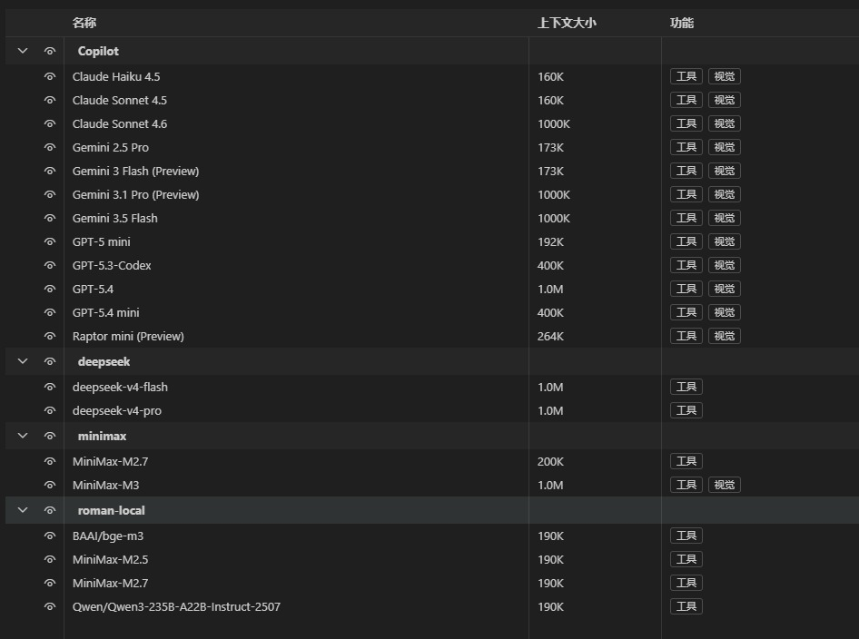

# DeepSeek Copilot Bridge

[English](README_EN.md) | 中文

为 VS Code 中的 Copilot 提供模型适配桥接的轻量服务，可将 DeepSeek、Qwen、MiniMax 以及本地模型服务统一转换为 Copilot 可以直接使用的Ollama接口。

<p align="center">
  
</p>
<p align="center">
  
</p>

## 功能特性

- **Copilot 桥接** - 面向 VS Code Copilot 的接入场景，补齐不同模型服务之间的接口适配
- **OpenAI 兼容** - 支持 `/v1/models`、`/v1/chat/completions` 等标准端点
- **多模型接入** - 可桥接 DeepSeek、MiniMax 以及本地 Ollama/LM Studio 等后端
- **配置简单** - 通过环境变量即可调整模型列表、能力声明和上下文长度

## 快速开始

```bash
# 安装依赖
npm install

# 修改.env.prod文件
支持所有兼容OpenAI的服务：DeepSeek、MiniMax、Qwen等

# 启动服务(两种方式选一种)
## PM2启动服务（后台启动）
npm start # 生产环境 (PM2) 执行顺序：先检测目录中的.env-*文件（可开启多个服务），再检测.env.prod

## Nodejs启动服务 （命令行启动）
node index.js [--config .env.prod]   # 开发环境

# Copilot配置
VSCode Copilot => 管理语言模型 => 添加模型 => Ollama => http://localhost:11435 (项目默认端口11435) => 选择模型

# 通过Copilot配置开机自动启动
VSCode Copilot => 选择本地模型 => 输入"将这个项目设置为开机自动启动"
```

## 配置说明

### 环境变量

| 变量 | 说明 | 默认值 |
|------|------|--------|
| `OPENAI_API_KEY` | API 密钥 | - |
| `OPENAI_BASE_URL` | 模型服务地址 | `https://api.deepseek.com/v1` |
| `PORT` | 服务监听端口 | `11435` |
| `CONTEXT_LENGTH` | 上下文长度 | `204800` |

### CAPABILITIES

声明模型支持的能力数组，可选值：

- `completion` - 文本补全
- `tools` - 函数调用
- `thinking` - 思考能力
- `vision` - 多模态图像输入能力

```dotenv
CAPABILITIES=["completion", "tools", "thinking"]
```

### MODELS

手动指定模型列表（为空时自动从 `OPENAI_BASE_URL/models` 获取）：

```dotenv
# 自动发现（推荐）
MODELS=[]

# 手动配置
MODELS=["deepseek-v4-flash", "deepseek-v4-pro"]

# 细粒度手动配置（优先级最高）
MODELS=`
[{
    "name": "MiniMax-M3",
    "content_length": 1000000,
    "capabilities": ["completion", "tools", "thinking", "vision"]
},
{
    "name": "MiniMax-M2.7",
    "content_length": 200000,
    "capabilities": ["completion", "tools", "thinking"]
}]
`
```

## 配置示例

### DeepSeek

```dotenv
OPENAI_API_KEY="sk-xxxxxxxx"
OPENAI_BASE_URL="https://api.deepseek.com"
PORT=11435
CAPABILITIES=["completion", "tools", "thinking"]
CONTEXT_LENGTH=1000000
MODELS=[]
```

### MiniMax

```dotenv
OPENAI_API_KEY="sk-api-xxxxxxxx"
OPENAI_BASE_URL="https://api.minimaxi.com/v1"
PORT=11435
CAPABILITIES=[]
CONTEXT_LENGTH=0
MODELS=`
[{
    "name": "MiniMax-M3",
    "content_length": 1000000,
    "capabilities": ["completion", "tools", "thinking", "vision"]
},
{
    "name": "MiniMax-M2.7",
    "content_length": 200000,
    "capabilities": ["completion", "tools", "thinking"]
}]
`
```

### 本地服务

```dotenv
OPENAI_API_KEY="sk-xxx"
OPENAI_BASE_URL="http://localhost:3001/v1"
PORT=11435
CAPABILITIES=["completion", "tools", "thinking"]
CONTEXT_LENGTH=200000
MODELS=[]
```

## 启动多个服务 (PM2)

项目支持在根目录中创建多个以 `.env-` 开头的配置文件（例如 `.env-1`, `.env-2`, `.env-3`），`ecosystem.config.js` 会自动扫描这些文件并为每个文件创建一个独立的 PM2 实例。

- 实例启动命令等价于：`node index.js --config <env-file>`，例如 `node index.js --config .env-1`。

示例：

1. 创建两个配置文件 `.env-1` 和 `.env-2`（示例内容）：

```powershell
# .env-1
OPENAI_API_KEY="sk-xxx-1"
OPENAI_BASE_URL="https://api.deepseek.com"
PORT=11435
CAPABILITIES=["completion","tools","thinking"]

# .env-2
OPENAI_API_KEY="sk-xxx-2"
OPENAI_BASE_URL="http://localhost:3001/v1"
PORT=11436
CAPABILITIES=["completion","tools"]
```

2. 使用 PM2 启动所有实例：

```powershell
npm run start
```

3. 常见错误与处理：

- 如果出现 `Port conflict` 错误，说明两个配置文件使用了相同的 `PORT`，请修改其中一个文件的 `PORT` 值；
- 如果出现 `Port <n> is already in use`，说明该端口被其他进程占用，请释放端口或更换 `PORT`。

此功能便于在同一台机器上并行运行多个不同环境或不同模型配置的实例，便于测试和分流请求。


## API 端点

服务启动后提供以下端点：
- `GET /v1/models` - 获取模型列表

## 目录结构

```
├── index.js          # 主入口
├── utils.js          # 工具函数
├── ecosystem.config.js  # PM2 配置
├── .env.dev          # 开发环境配置（优先读取）
└── .env.prod         # 生产环境配置
```


